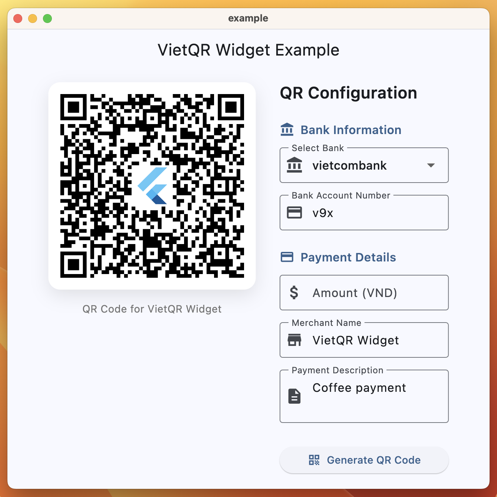

# VietQR Widget

Language: English | [Tiếng Việt](README.vi.md)

A Flutter UI widget to display VietQR codes. Built on top of [vietqr_core](../vietqr_core) for encoding and [pretty_qr_code](https://pub.dev/packages/pretty_qr_code) for rendering beautiful QR codes.

## Features

* **Easy to use** – Simple Flutter widget for displaying VietQR codes
* **Customizable** – Support for background colors and embedded images
* **Error handling** – Built-in error handling with customizable error widgets
* **Auto-encoding** – Automatically encodes VietQR data using vietqr_core
* **Responsive** – Adapts to different screen sizes and orientations
* **Type-safe** – Full Flutter and Dart type safety

If you want to say thank you, star us on GitHub or like us on pub.dev.

<p align="center">
  
</p>

## Usage

First, follow the [package installation instructions](https://pub.dev/packages/vietqr_widget/install) and add a `VietQrWidget` widget to your app:

### Basic Example

```dart
VietQrWidget(
  data: VietQrData(
    bankBinCode: SupportedBank.vietcombank,
    bankAccount: '0123456789',
    amount: '50000',
    merchantName: 'John Doe',
    merchantCity: 'Ho Chi Minh City',
    additional: const AdditionalData(
      purpose: 'Payment for invoice #12345',
    ),
  ),
)
```

### Example with Embedded Image

```dart
VietQrWidget(
  data: VietQrData(
    bankBinCode: SupportedBank.techcombank,
    bankAccount: '0123456789',
    merchantName: 'Coffee Shop ABC',
    merchantCity: 'Hanoi',
    additional: const AdditionalData(
      purpose: 'Coffee payment',
    ),
  ),
  background: Colors.white,
  embeddedImage: EmbeddedImage(
    scale: 0.2,
    image: AssetImage('assets/logo.png'),
  ),
  errorBuilder: (context, error, stackTrace) {
    return Icon(
      Icons.error_outline,
      color: Colors.red,
      size: 48,
    );
  },
)
```

## Error Handling

The widget includes built-in error handling for VietQR encoding errors:

```dart
VietQrWidget(
  data: myVietQrData,
  errorBuilder: (BuildContext context, Object error, StackTrace? stackTrace) {
    if (error is VietQrException) {
      return Container(
        padding: EdgeInsets.all(16),
        decoration: BoxDecoration(
          color: Colors.red.shade50,
          borderRadius: BorderRadius.circular(8),
        ),
        child: Column(
          mainAxisSize: MainAxisSize.min,
          children: [
            Icon(Icons.error_outline, color: Colors.red),
            SizedBox(height: 8),
            Text(
              'QR Code Error',
              style: TextStyle(
                fontWeight: FontWeight.bold,
                color: Colors.red,
              ),
            ),
            Text(error.message),
          ],
        ),
      );
    }
    return Icon(Icons.error_outline, color: Colors.red);
  },
)
```

## VietQR Data

This widget uses the `VietQrData` class from [vietqr_core](https://pub.dev/packages/vietqr_core). For detailed information about creating and configuring VietQR data, please refer to the [vietqr_core documentation](https://pub.dev/documentation/vietqr_core/latest).

### Quick VietQR Data Example

```dart
// Static QR with fixed amount
final staticQr = VietQrData(
  bankBinCode: SupportedBank.vietcombank,
  bankAccount: '0123456789',
  amount: '100000', // 100,000 VND
  merchantName: 'My Store',
  merchantCity: 'Ho Chi Minh City',
);

// Dynamic QR where user enters amount
final dynamicQr = VietQrData(
  bankBinCode: SupportedBank.techcombank,
  bankAccount: '9876543210',
  merchantName: 'My Store',
  merchantCity: 'Hanoi',
  // No amount specified - user will enter when scanning
);
```

## Example App

For a complete example with interactive QR code generation, check out the [example](example/) directory in this package.

## Contributing

1. Fork the repository
2. Create your feature branch (`git checkout -b feature/amazing-feature`)
3. Commit your changes (`git commit -m 'Add some amazing feature'`)
4. Push to the branch (`git push origin feature/amazing-feature`)
5. Open a Pull Request
