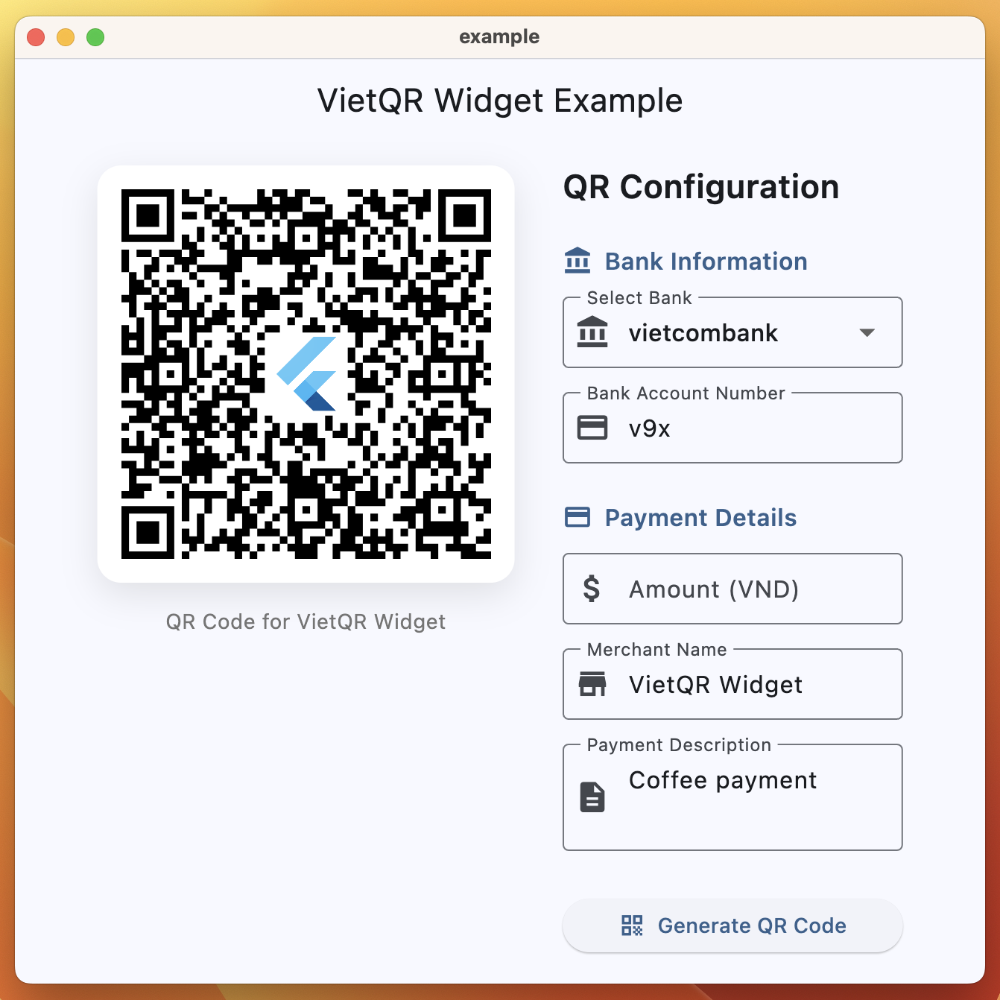

# VietQR Widget

Ngôn ngữ: [English](README.md) | Tiếng Việt

Widget Flutter để hiển thị mã QR VietQR. Được xây dựng dựa trên [vietqr_core](../vietqr_core) để mã hóa và [pretty_qr_code](https://pub.dev/packages/pretty_qr_code) để render mã QR đẹp mắt.

## Tính năng

* **Dễ sử dụng** – Widget Flutter đơn giản để hiển thị mã VietQR
* **Tùy chỉnh** – Hỗ trợ màu nền và hình ảnh nhúng
* **Xử lý lỗi** – Xử lý lỗi tích hợp với widget lỗi có thể tùy chỉnh
* **Tự động mã hóa** – Tự động mã hóa dữ liệu VietQR bằng vietqr_core
* **Responsive** – Thích ứng với các kích thước và hướng màn hình khác nhau
* **Type-safe** – Đảm bảo an toàn kiểu dữ liệu Flutter và Dart

Nếu bạn muốn cảm ơn, hãy star cho chúng tôi trên GitHub hoặc like trên pub.dev.

<p align="center">
  
</p>

## Cách sử dụng

Trước tiên, làm theo [hướng dẫn cài đặt package](https://pub.dev/packages/vietqr_widget/install) và thêm widget `VietQrWidget` vào ứng dụng của bạn:

### Ví dụ cơ bản

```dart
VietQrWidget(
  data: VietQrData(
    bankBinCode: SupportedBank.vietcombank,
    bankAccount: '0123456789',
    amount: '50000',
    merchantName: 'John Doe',
    merchantCity: 'Ho Chi Minh City',
    additional: const AdditionalData(
      purpose: 'Thanh toán hóa đơn #12345',
    ),
  ),
)
```

### Ví dụ với hình ảnh nhúng

```dart
VietQrWidget(
  data: VietQrData(
    bankBinCode: SupportedBank.techcombank,
    bankAccount: '0123456789',
    merchantName: 'Quán cà phê ABC',
    merchantCity: 'Hà Nội',
    additional: const AdditionalData(
      purpose: 'Thanh toán cà phê',
    ),
  ),
  background: Colors.white,
  embeddedImage: EmbeddedImage(
    scale: 0.2,
    image: AssetImage('assets/logo.png'),
  ),
  errorBuilder: (context, error, stackTrace) {
    return Icon(
      Icons.error_outline,
      color: Colors.red,
      size: 48,
    );
  },
)
```


## Xử lý lỗi

Widget bao gồm xử lý lỗi tích hợp cho các lỗi mã hóa VietQR:

```dart
VietQrWidget(
  data: myVietQrData,
  errorBuilder: (BuildContext context, Object error, StackTrace? stackTrace) {
    if (error is VietQrException) {
      return Container(
        padding: EdgeInsets.all(16),
        decoration: BoxDecoration(
          color: Colors.red.shade50,
          borderRadius: BorderRadius.circular(8),
        ),
        child: Column(
          mainAxisSize: MainAxisSize.min,
          children: [
            Icon(Icons.error_outline, color: Colors.red),
            SizedBox(height: 8),
            Text(
              'Lỗi mã QR',
              style: TextStyle(
                fontWeight: FontWeight.bold,
                color: Colors.red,
              ),
            ),
            Text(error.message),
          ],
        ),
      );
    }
    return Icon(Icons.error_outline, color: Colors.red);
  },
)
```

## Dữ liệu VietQR

Widget này sử dụng class `VietQrData` từ [vietqr_core](https://pub.dev/packages/vietqr_core). Để biết thông tin chi tiết về việc tạo và cấu hình dữ liệu VietQR, vui lòng tham khảo [tài liệu vietqr_core](https://pub.dev/documentation/vietqr_core/latest).

### Ví dụ nhanh về VietQR Data

```dart
// QR tĩnh với số tiền cố định
final staticQr = VietQrData(
  bankBinCode: SupportedBank.vietcombank,
  bankAccount: '0123456789',
  amount: '100000', // 100,000 VND
  merchantName: 'Cửa hàng của tôi',
  merchantCity: 'Thành phố Hồ Chí Minh',
);

// QR động - người dùng nhập số tiền khi quét
final dynamicQr = VietQrData(
  bankBinCode: SupportedBank.techcombank,
  bankAccount: '9876543210',
  merchantName: 'Cửa hàng của tôi',
  merchantCity: 'Hà Nội',
  // Không chỉ định số tiền - người dùng sẽ nhập khi quét
);
```

## Ứng dụng ví dụ

Để xem ví dụ hoàn chỉnh với tạo mã QR tương tác, hãy xem thư mục [example](example/) trong package này.

## Đóng góp

1. Fork repository
2. Tạo nhánh tính năng (`git checkout -b feature/amazing-feature`)
3. Commit thay đổi (`git commit -m 'Add some amazing feature'`)
4. Push lên nhánh (`git push origin feature/amazing-feature`)
5. Mở Pull Request